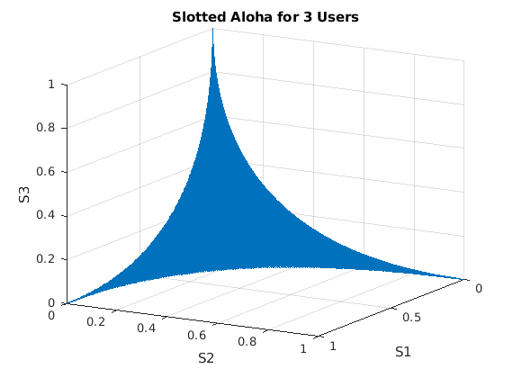
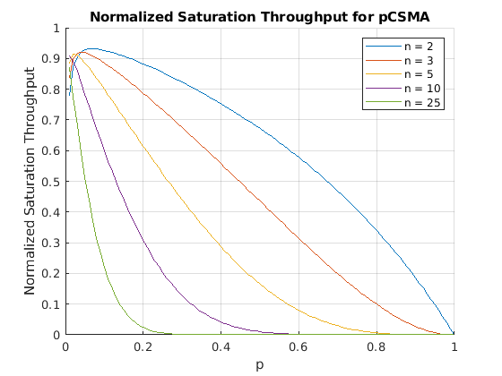
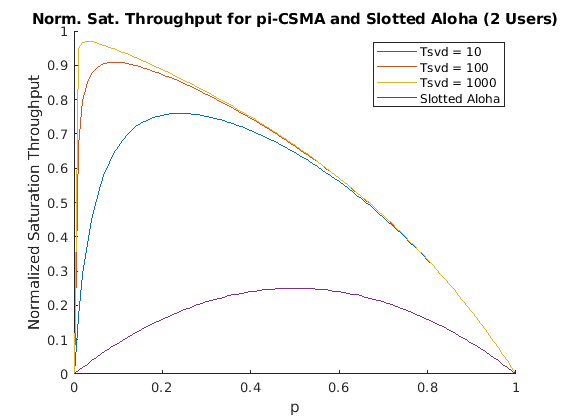
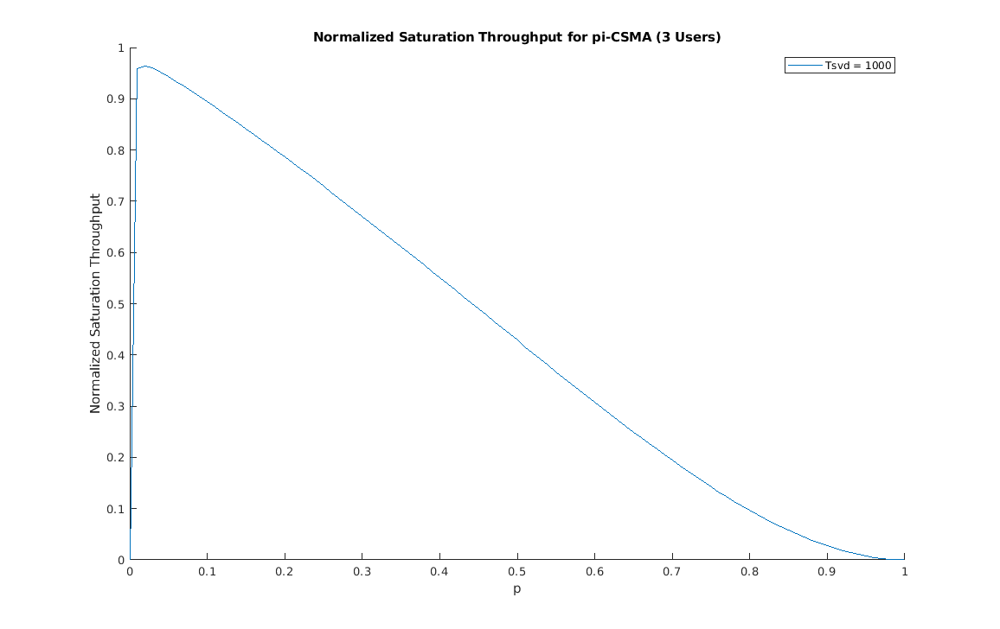

# ee597-assignment3
An analysis of normalized saturation throughput for slotted Aloha and p-CSMA.

by 
Bill Wang               student id: 
and 
Spencer McDonough       student id: 

## **Problem 1:** For slotted Aloha with 3 backlogged users, plot the boundary surface of the normalized saturation throughput region using a 3D plot.

## **Problem 2:** Plot the normalized saturation throughput of p-persistent CSMA as a function of p (assuming all users have the same p) for different values of n.
### Let Ts = 9000 µs, Tc = 8750 µs, the slot time δ = 50 µs. (These are typical numbers for IEEE 802.11). Identify and plot the optimal p parameter as a function of n. Comment on your results

**Discussion:** As we can see, the saturation throughput falls off much quicker with increasing p as we increase the number of users on the network. However, with the right tuning. we can achieve about the same normalized saturation throughput if everyone transmitts with a low probability. This can be seen in figure 2b below.

In p-CSMA, users only have to wait for the length of the idle time slot before transmitting again. Because our idle time slots are much smaller than our successful and collision time slots, we do not pay too much for added users, and our link utilization remains high. However, this is dependent on every user transmitting with p = 1/n, else the link utilization greatly suffers for all users.

## **Problem 3:** Plot the 2-user normalized saturation throughput region for pi-persistent CSMA for different values of Ts/δ = 10, 100, 1000, assuming Ts = Tc. On the same figure, also plot the 2-user throughput region for slotted Aloha.

## **Problem 4:** For 3 blacklogged users, plot the saturation throughput region for pi-persistent CSMA assuming Ts/δ = 1000 (again, Ts = Tc).
